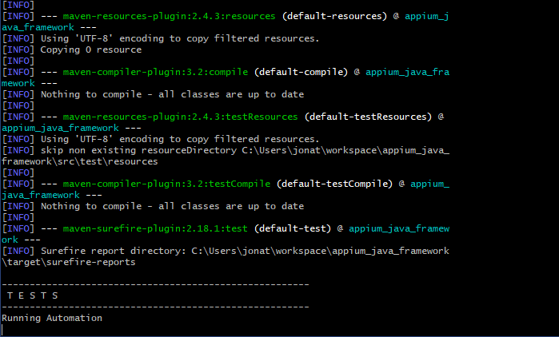

# Appium Java Framework
> A test automation framework for Android apps.

The purpose of this project is to demonstrate how to automate app tests using Java, Appium, Cucumber and the approach of Page Object Model.

## Requirements

* _Build tool_, _Android SDK_, _Android virtual device_ and an _Android image_.
	* [Android Studio](https://developer.android.com/studio) has everything together.
* [Appium](http://appium.io/) 1.13.0 or superior
* [Java 11 JDK](https://www.oracle.com/technetwork/java/javase/downloads/jdk11-downloads-5066655.html)
* _IDE for Java development_ [IntelliJ](https://www.jetbrains.com/idea/)
	* Install the following plugins: _Cucumber for Java_, _Cucumber Scenarios Indexer_, _Gherkin_, _google-java-format_
* [Maven 3.6 or superior](https://maven.apache.org/)
* Environment variables in you Operational System:
	* ANDROID_HOME: Android sdk root directory
	* PATH: ANDROID_HOME + the following paths = _platform-tools_, _tools_, _tools/bin_
	* PATH: The path of maven folder + _/bin_

## Project Structure

```
appium_java_framework
	app_under_testing
	properties
		app
		device
	src.test.java
		general
			Setup.java
			Step.java
		main_screen
			test_cases
				AmountCalculation.feature
			MainPageObjects.java
			MainScreenSteps.java
		tip_settings			
		Automation.java
	target
```

* The _app_under_testing_ folder contains the apk under testing. However, it is possible that the job manager, e.g. Jenkins, edit the properties setting the location of the app.
So you do not need to commit any change in your suite for being able to run the tests in a new version of the app. Also, you have the advantage of getting this data automatically by putting the automation in the pipeline of software development.

* The _properties_ folder contains files with settings about the app and the device in your environment. You must edit these files and replace the asked information according to the environment you have.

* The _src.test.java_ contains packages for the modules of the app under testing.
	* _general_ package contains classes for generic purposes.
	* _AmountCalculation.feature_ is the test cases itself. Each step calls a method of MainScreenSteps. Cucumber does this magic.
	* _MainScreenSteps_ contains the implementation for interacting with the Page Objects in order to test what the test case says. This class does not need to bother about the driver because its father Step.java has the driver.
	* _MainPageObjects_ is an object repository for the user interface elements of that specific interface. It imports the page factories linking elements to variables and provides methods for interacting with the elements.
	* _target_ folder contains the reports of test execution.
* Automation.java is the class used for running the automation via maven (mvn test). The task calls this executor class which then calls the test cases by tag. The class calls all of the test cases that contain the tag setted, e.g. @Automation.

## Test setup

Once you have the required tools installed, you may run the automation through the IDE by going to the Automation.java class and click the option Run.
You may also run just one test case by going to the .feature and then clicking the Run option.

However, when you run the tests continuously, call them via command line by the _test_ maven task.

```sh
mvn test
```

Your should see a log like this:



After the tests are finished you will find the reports in _target/cucumber-html-report/index.html_
If you are running the automation through Jenkins with Cucumber plugin, then please make sure it gets the json file from _target/cucumber-html-report.json_

## Meta

Jonatas Kirsch – [Linkedin](https://linkedin.com/in/jonataskirsch)


## Contributing

1. Fork it (<https://github.com/jonatask/appium-java-framework/fork>)
2. Create your feature branch (`git checkout -b feature/fooBar`)
3. Commit your changes (`git commit -am 'Add some fooBar'`)
4. Push to the branch (`git push origin feature/fooBar`)
5. Create a new Pull Request